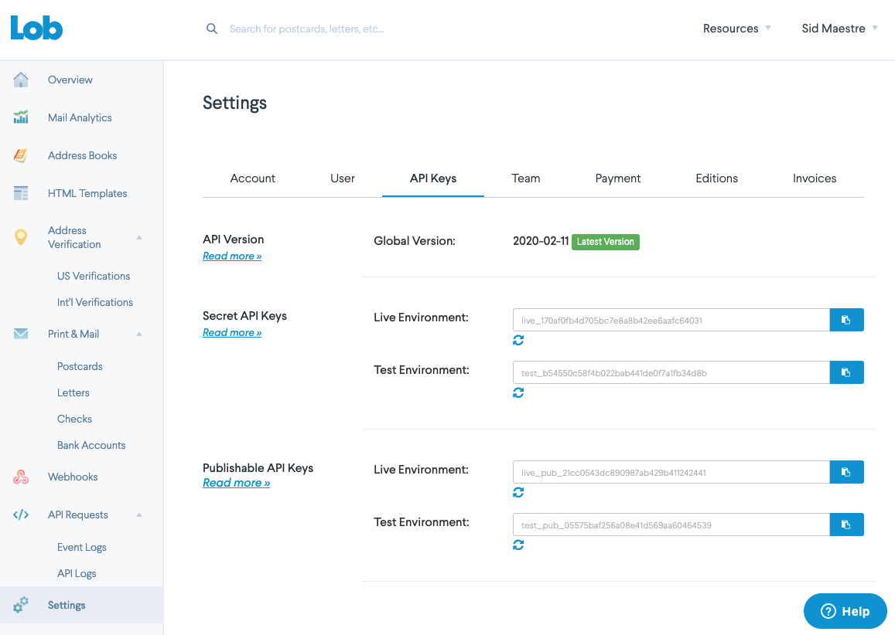

# Lob Insomnia
An Insomnia REST client collection for calling Lob API endpoints

## Steps to get up and running
Follow these steps to quickly get up and running with the Lob API and Insomnia.

---

### 1. Download Insomnia Client
Visit Insomnia and download the desktop client.
> http://insomnia.rest/

---

### 2. Get your API keys

Create an account at [Lob.com](https://dashboard.lob.com/#/register)

Login to Lob dashboard and navigate to [Settings](https://dashboard.lob.com/#/settings/account)

You'll use the test_*. for your Test API key and live_*. for your Live API key.

----

## 3. Import the Lob Insomnia collection

&uri=https%3A%2F%2Fraw.githubusercontent.com%2FSerKnight%2FXero-Insomnia%2Fmaster%2FInsomnia_basic.json)

---

### 4. Add `client_id`, `client_secret` and `scopes` to the environment variables in Insomnia
Get the id & secret from your /myapps API app.

Understand & pick your XeroAPI scopes.
> https://developer.xero.com/documentation/oauth2/scopes

> At a minimun you probably want to add `"openid profile email offline_access accounting.transactions"` - and if you chose the **Full Collection** you will have to add (_basically_) all the scope to interact with all the imported endpoints.

Finally, copy those 3 items into this file in your desktop client.

---

### 5. Authorize Xero and and get your access_token

Click 'Fetch Tokens' which will prompt a Xero login screen.

Once you return it should populate the access & refresh token.

You can now add an actual request to the Authorize OAuth2 panel to hit the /connections route via POST which will use the access_token to return your active connections.

Once the /connection route is setup, click `Send`, this will return your active API connections. Chose a `tenantId` to populate in your environment file's empty `tenant_id` value.

Then paste both the `tenant_id` & the `access_token` into the environment file.

---

### 6. Paste the access_token back into your environment variables
Once you have an `access_token` plugged in, you will be able to make API calls.

---
### 7. Refresh token for continued access
You can continually visit the `Authentication` route to refresh a token by clicking `Refresh Token`.

---

**IMPORTANT**

You will need to copy/paste your refreshed `access_token` into the env variables section each time you refresh your token_set.

_~13 min video tutorial on setting up Insomnia_
> https://www.youtube.com/watch?v=H_k8Z8Zq99s

_Blogpost on setting up Insomnia_
> https://devblog.xero.com/insomnia-client-xeroapi-auth-1c4cf485f251