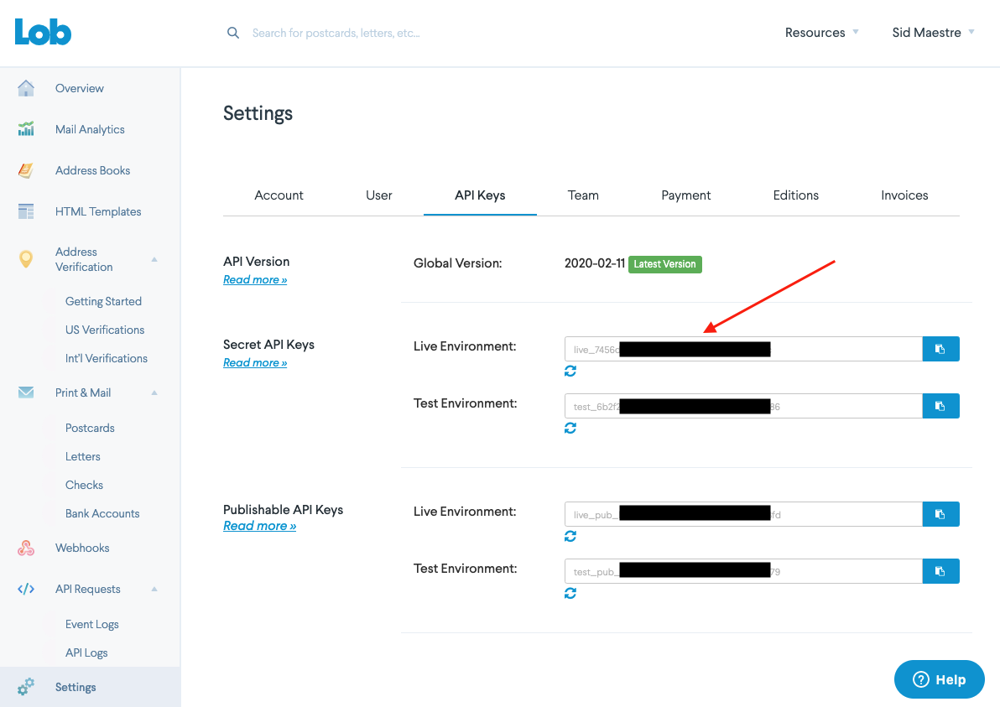

# Lob Insomnia
An Insomnia REST client collection for calling Lob API endpoints

## Steps to get up and running
Follow these steps to quickly get up and running with the Lob API and Insomnia.

---

### 1. Download Insomnia Client
Visit Insomnia and download the desktop client.
> http://insomnia.rest/

---

### 2. Get your API keys

Create an account at [Lob.com](https://dashboard.lob.com/#/register)

Login to Lob dashboard and navigate to [Settings](https://dashboard.lob.com/#/settings/account)

You'll use the test_*. for your Test API key and live_*. for your Live API key.

----

## 3. Import the Lob Insomnia collection

---

### 4. Add your Test API key `test_b545XXXXXXXXXXXXXXd8b` to the environment variables in Insomnia

Get the test API key from [Settings](https://dashboard.lob.com/#/settings/account) in Lob.

Go to the environment dropdown in Insomnia desktop and select `Manage Environments`.

Paste your Lob Test API key into your Insomnia desktop client and click Done.

---
### 7. Refresh token for continued access
You can continually visit the `Authentication` route to refresh a token by clicking `Refresh Token`.

---

**IMPORTANT**

You will need to copy/paste your refreshed `access_token` into the env variables section each time you refresh your token_set.

_~13 min video tutorial on setting up Insomnia_
> https://www.youtube.com/watch?v=H_k8Z8Zq99s

_Blogpost on setting up Insomnia_
> https://devblog.xero.com/insomnia-client-xeroapi-auth-1c4cf485f251